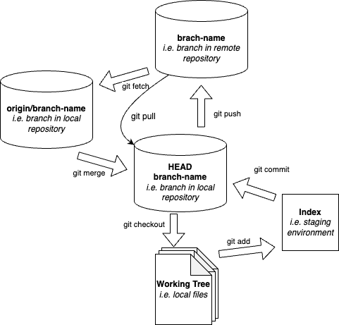
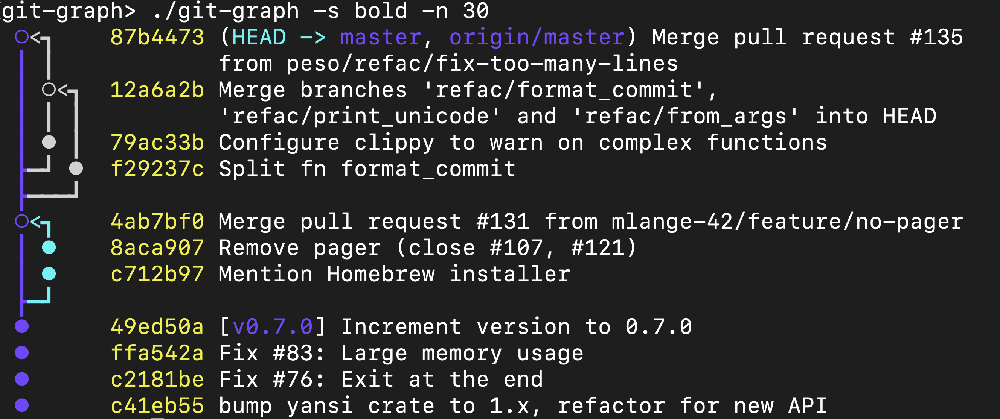
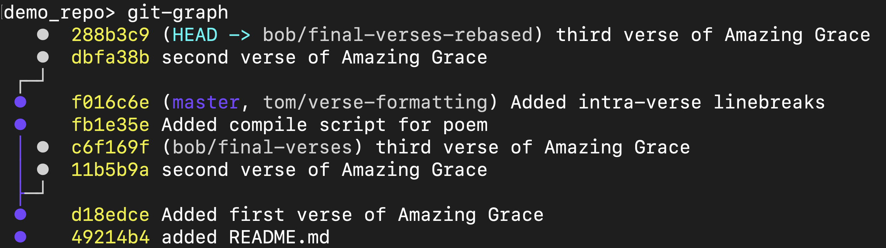

% Git Workflow & Some GTest
% Joshua Zingale

# The "Save As" Nightmare
* **Version Fatigue:** We’ve all been there: `script_v1.py`, `script_v2_final.py`, `script_v2_final_FIXED.py`.
* **Lack of Context:** What exactly is different between this and that version?
* **Risk:** Deleting a block of code to "try something else" often means losing the original work forever if you don't have a backup.

---

# Compounding Issues in a Team
* **The "Overwriting" Problem:** Two people edit the same file at the same time. Who wins?
* **The "Broken Master" Problem:** One person's experimental code breaks the entire project for everyone else.
* **Communication Overhead:** Constantly asking "Are you working on the login page?" or "Which version is the latest?" slows down development.

---

# Enter: Version Control Systems (VCS)
* **The Time Machine:** VCS records every change made to the codebase.
* **The Auditor:** It tracks *who* made the change, *when*, and *why*.
* **The Safety Net:** It allows you to experiment boldly, knowing you can always revert to a "known good" state.
* **Git** is the industry standard for distributed version control.

---

# Git Architecture

::: columns

:::: {.column width="50%"}
\
::::

:::: {.column width="50%"}
## Typical workflow

```bash
# Download repo
git clone <uri>

# Edit file
vim README.md

# Track file
git add README.md

# Store fix locally
git commit -m "grammar"

# Store commit on remote
git push
```

::::
:::
---

# Core Concept: Commits & Rollbacks
* **The Snapshot:** A "Commit" isn't just a save point; it's a snapshot of your entire project at a specific moment.
* **The Hash:** Each commit has a unique ID.
* **Rollbacks:** If a new feature introduces a critical bug, you can "checkout" or "revert" to a previous commit instantly.
* *Safety first: No work is ever truly lost^[unless you like to live on the edge and use `git push -f`: don don don...].*

---

# Core Concept: Branching
* **Parallel Universes:** Branching allows you to diverge from the main project line (often called `main` or `master`).
* **Isolated Development:** You can build a "Dark Mode" feature on one branch while a teammate fixes a "Login Bug" on another.
* **Zero Interference:** Changes in a branch do not affect the main codebase until you are ready.

---

# Core Concept: Merging
* **Bringing it Together:** Once a feature is finished and tested in its branch, you "Merge" it back into the main line.
* **Automatic Integration:** Git is smart---it combines changes from different files automatically.
* **Conflict Resolution:** If two people edited the exact same line, Git pauses and asks you to choose which version to keep.

---

# Example of Branching and Merging
\

---

# Core Concept: Rebasing
* **Cleaning Up History:** Instead of a messy "merge commit," Rebasing moves your entire branch to begin on the tip of the main branch.
* **The "Linear" Advantage:** It makes the project history look like a straight line, making it much easier to read and debug.
* **Pro Tip:** Use Rebase to keep your feature branch up-to-date with the latest changes from your team.


---

# Example of Rebased Branch
\


---

# Merge Conflicts!

\footnotesize
```
Auto-merging main.cpp
CONFLICT (content): Merge conflict in main.cpp
Automatic merge failed; fix conflicts and then commit the result.
```
\normalsize

\footnotesize
```c++
// main.cpp
#include <iostream>
#include <string>
int main()
{
<<<<<<< HEAD
    std::cout << "hello git!" << std::endl;
    Std::cout << “git is easy?” << std::endl;
    return 1;
=======
    std::string name;
    std::cout << "What is your name?" << std::endl;
    std::cin >> name;
    std:::cout << "Hello " << name << "!" << std::endl;

    return 0;
>>>>>>> whodidthis/add-user-input
}
```
\normalsize

--- 

# Resolving Conflicts Pt. 1

1. Put the file in the state you want it:
\footnotesize
```c++
// main.cpp
#include <iostream>
#include <string>
int main()
{
	std::string name;
	std::cout << "What is your name?" << std::endl;
	std::cin >> name;
	std:::cout << "Hello " << name << "!" << std::endl;
	return 0;
}
```
---

# Resolving Conflicts Pt. 2

2. Difference between `merge` and `rebase`:
	* If using `git merge`, you must make a commit with `git commit`
	* If using `git rebase`, `git add` the resolved files and run `git rebase --continue`

If the merge/rebase is too scary to deal with right now, use

- `git merge --abort` or
- `git rebase --abort`

At any stage, `git status` will respond with a message telling you what needs to happen.
---

# GTest

::: columns

:::: {.column width="40%"}

* Testing C++ code requires that one
    - write a test harness
    - write tests
    - link the tests with the code-to-test
    - compile the tests
    - and run the tests.
* GTest is a Google-maintained testing framework for C++

::::

:::: {.column width="60%"}

\small
```c++
#include <gtest/gtest.h>
#include <sum.hpp>
TEST(SumTest, PositiveIntegers) {
	int array[] = {1,2,3,4,5};
	EXPECT_EQ(15, sum(
		sizeof(array)/sizeof(int),
		array));
}
TEST(SumTest, MixedIntegers) {
	int array[] = {1,2,-3,4,5};
	EXPECT_EQ(9, sum(
		sizeof(array)/sizeof(int),
		array));
}
int main(int argc, char **argv) {
	::testing::InitGoogleTest(
		&argc,
		argv);
	return RUN_ALL_TESTS();
}
```
\normalsize

::::


:::