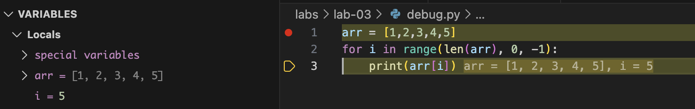
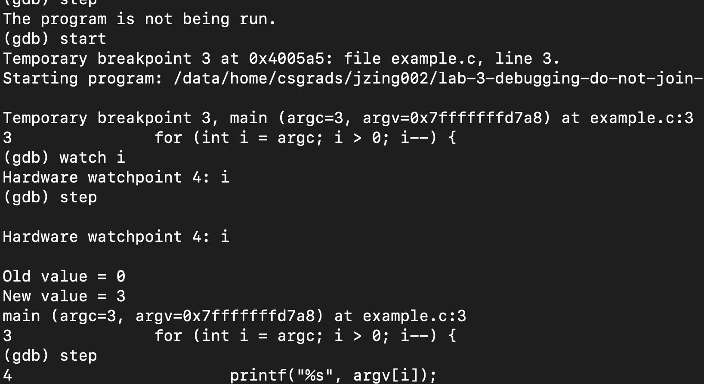
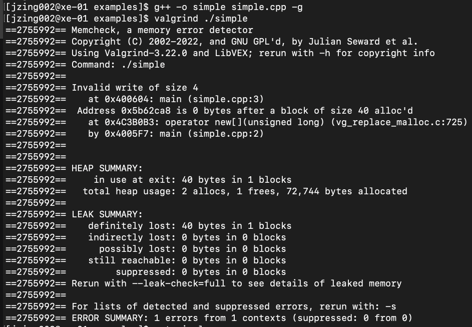

% Debugging C/C++: GDB & Valgrind
% Joshua Zingale

# Debuggers

- A Debugger is a tool that helps track the execution of a program, often line-by-line.
- Can help identify errors.
    - e.g. "Aha! `i` should be `4` here but I see that it is `5`."

\

# Problems Debugging C/C++

- They are compiled.
    - i.e. Each line is not actually executed by the computer. Instead, sequences of machine code generated from each line are run.
- Optimizers in the compiler may change code
    - e.g. ```int a = 3; int b = 4; int c = a*b``` may be simplified to `int c = 12;`.


# Compilation with Debug Info

- GXX and CLang compilers have the `-g` flag to enable the compilation of debug information into the generated executable.
- Compiled executable is bigger and slower and may produce an extra folder containing symbol information.

```
lab-03> g++ example.cpp -o example              
lab-03> g++ example.cpp -g -o ex_with_debug_info
lab-03> ls -l example ex_with_debug_info
-rwxr-xr-x@ 1 ... 42944 ... ex_with_debug_info
-rwxr-xr-x@ 1 ... 39656 ... example
```

# GDB

- Can step through an executable compiled with `-g` "line-by-line".
- Can set breakpoints to halt execution automatically once a specific line is reached.


::: { .columns }

:::: { .column width=50% }

\footnotesize
```c
#include<stdio.h>
int main(int argc, char *argv[]) {
  for (int i = argc; i > 0; i--) {
    printf("%s", argv[i]);
  }   
  return 0;
}
```
\normalsize
::::
:::: {.column width=50%}
\
::::

:::

# Memory Issues

- Reading/Writing to memory that you do not own.
- Allocating memory without freeing it.
    - a.k.a. a memory leak
- Double free.
    - Can lead to data corruption, even arbitrary code execution.
- Use After free.
    - Again, can lead to data corruption or arbitrary code execution.
- Use of uninitialized data.
    - Anything could be stored in the uninitialized portion.

# Valgrind

> A memory watchdog!

- Runs an executable and tracks each allocation and free.
- Reports
    - illegal memory accesses,
    - memory leaks,
    - double frees,
    - use after frees,
    - and use of uninitialized data.
- Better reporting when the executable is compiled with `-g`.


# Valgrind Example

::: { .columns }


:::: { .column width=50% }

- One illegal write.
- One memory leak.

```c++
int main() {
    int *p = new int[10];
    p[10] = 1;

    return 0;
}
```
::::
:::: { .column width=50% }

\

::::
:::

# Memory (De-)Allocation in Other Languages

- Memory allocation and deallocation is difficult and error-prone.
- Modern languages, even C++, provide mechanisms for safer handling. e.g.
    - Automatically allocated structures
    - Compile- || run-time Checking


# C++

In C++, use library provided structures that handle allocation like `std::vector`

```c++
#include<vector>
int main() {
    {
        std::vector<int> vec;
        for (int i; ...) {
            vec.push_back(f(i));
        }

    } // <---- Vec is deallocated here automatically
    return 0;
}
```

# Rust

Rust requires lifetime annotations so that the compiler can verify the absence of use-after-free errors.

\small
```rust
struct Book<'a> {
    title: &'a str, // cannot outlive Book
}
fn main() {
    let book;
    {
        // Suppose we try to point to a
        // string with a shorter life
        let short_lived_string = String::from("E");
        book = Book { title: &short_lived_string }; 
    } // <--- short_lived_string is freed here

    // COMPILE-TIME ERROR: book.title points
    // to memory that was just freed!
    println!("{}", book.title); 
}
```
\normalsize

# Zig

Zig makes allocation explicit. The `errdefer` or `defer` keyword ensures the free happens at the end of the scope, preventing leaks.

```zig
const std = @import("std");

pub fn main() !void {
    var gpa = std.heap.GeneralPurposeAllocator(.{}){};
    const allocator = gpa.allocator();

    var list = std.ArrayList(i32).init(allocator);
    // Defer runs at the end of the block
    defer list.deinit(); 

    try list.append(42);
} // <--- list.deinit() runs here
```