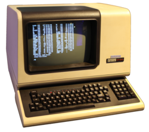
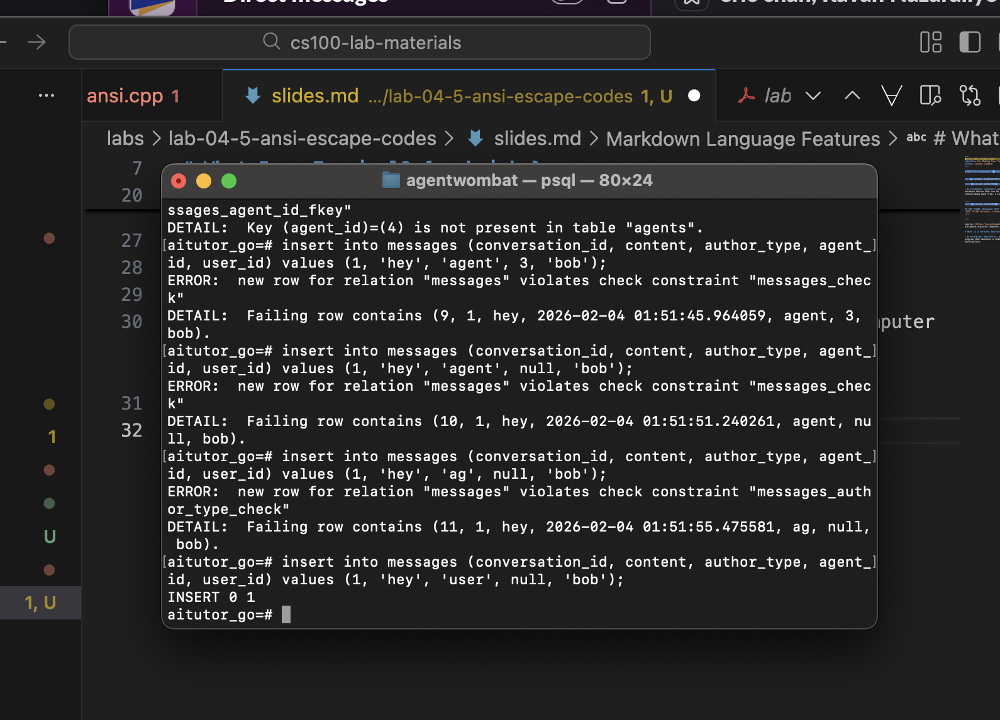
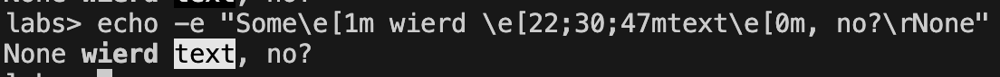
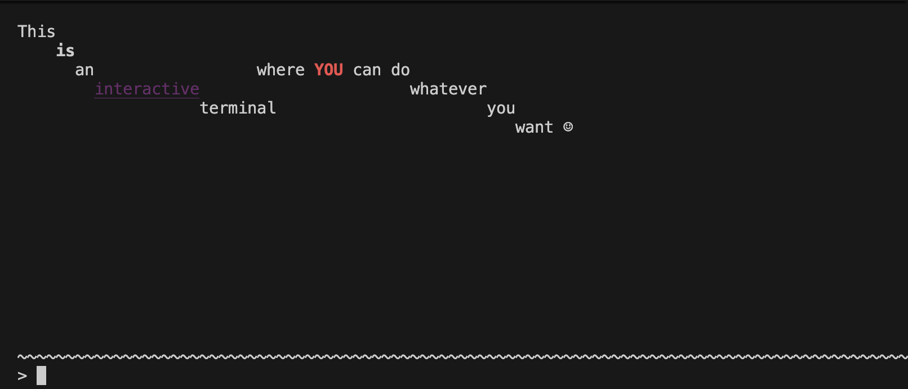

# What Is a Terminal? { .shrink }

::: { .columns align=center}

:::: { .column width=50% }

> A **computer terminal** is an electronic or electromechanical hardware device that can be used for entering data into, and transcribing data from, a computer or a computing system.

::::
:::: { .column width=50% }

## DEC VT100, Released 1978
\
::::

:::

/tiny
source: [https://en.wikipedia.org/wiki/Computer_terminal](https://en.wikipedia.org/wiki/Computer_terminal)
/normalsize

# What Is a Terminal Emulator?

::: { .columns align=center}

:::: { .column width=50% }

> A **terminal emulator**, or **terminal application**, is a computer program that emulates a video terminal within another display architecture.

\tiny
source: [https://en.wikipedia.org/wiki/Terminal_emulator](https://en.wikipedia.org/wiki/Terminal_emulator)
\normalsize

::::
:::: { .column width=50% }

## Terminal Emulator on MacOS
/
::::

:::

# Escape Codes

Since terminals had very basic display abilities, often purely character based,
they accepted **escape codes** to modify the visual output of the terminal.

For example, the following hex values on DEC terminals had special meaning:

- **0x07** --- *\\a* --- make a bell sound
- **0x0A** --- *\\n* --- linefeed, i.e. advance to the next line
- **0x1B** --- *\\e* --- *ESC*, used to introduce longer escape sequences
- &c

# Using Escape Codes

Even today, years after physical terminals' heyday, the same escape code are used to create terminal UIs (TUIs).

\

# Demonstration 

Available for download on GitHub^[[https://github.com/joshua-zingale/cs100-lab-materials/tree/master/labs/lab-04-5-ansi-escape-codes/interactive-ansi](https://github.com/joshua-zingale/cs100-lab-materials/tree/master/labs/lab-04-5-ansi-escape-codes/interactive-ansi)]

## Interactive Escape Code Entry

\

