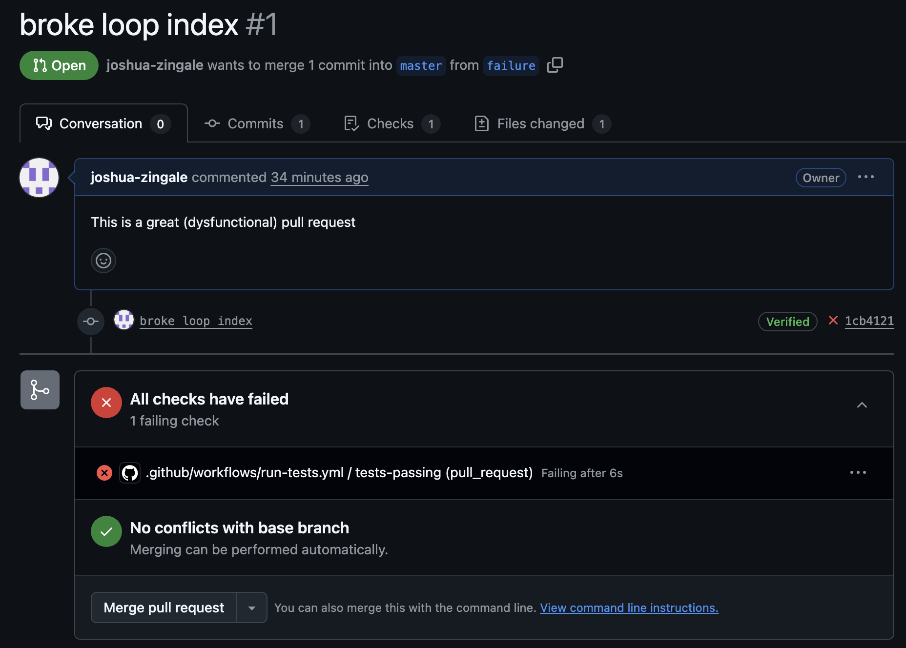
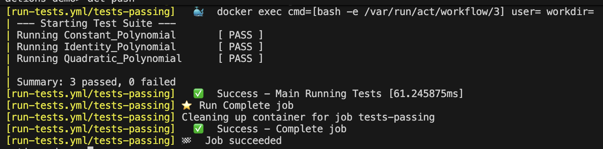

---
title: GitHub Workflows
subtitle: Continuous Integration
author: Joshua Zingale
--- 

# GitHub Workflows

A **workflow** is an execution environment that runs after a specified trigger occurs.
A workflow can

- review all incoming pull requests
- generate releases that contain compiled versions of software
- close issues to do not meet eligibility criteria
- &c

# How Does a Workflow... Work?


- GitHub looks inside each repository's `.github/workflows/` folder for YAML files.
- Each YAML file defines one workflow.
- If a workflow is trigger (e.g. by a pull request), GitHub spins up a container that runs code specified in the workflow's YAML file.
- The workflow succeeds iff no process run in the workflow returns a non-zero error status.

# Automated Testing

This workflow automatically runs on every pull request and push to master.

::: { .columns }

:::: { .column width=50% }
## Example

\tiny
```yaml
on:
    pull_request:
        branches:
            - master
    push:
        branches:
            - master
jobs:
    tests-passing:
        runs-on: ubuntu-latest
        steps:
            - name: Cloning Repo
              uses: actions/checkout@v5
            - name: Compiling Source
              run: cmake . && cmake --build .
            - name: Running Tests
              run: ./bin/test
```
\normalsize
::::

:::: { .column width=50% }

## Failed Pull Request

\

::::

:::

# `act`: Testing Workflows Locally

Pushing to GitHub every time you modify your workflow is not the best way to test it. [act](https://github.com/nektos/act) provides a local runner that emulates GitHub workflow dispatches.

- `act push` will run all workflows that are activated on a push.
- `act -j JOB-NAME` will run a specific workflow job by name.

```bash
act -j tests-passing
```


\