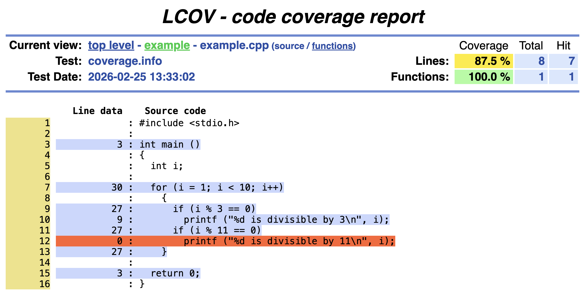

# Unit Testing

Unit testing evaluates code at the function level to identify errors early.


## GTest Example

```c++
#include <gtest/gtest.h>
#include "Calculator.h"
TEST(CalculatorTest, HandlesAddition) {
    Calculator calc;
    
    EXPECT_EQ(calc.add(2, 2), 4);
    EXPECT_EQ(calc.add(-1, 1), 0);
    
    ASSERT_NE(calc.get_version_string(), ""); 
}
```


# When Is the Number of Tests Sufficient?

- Ideally, all unit tests passing should indicate that the system functions as intended.
- Therefore, unit tests should evaluate all aspects of a system.


# Code Coverage

Code coverage is a measure of the amount of code that is "touched" during the execution of a program.

It is typically measured as a percentage, where 100% means that every branch in a program is executed at least once.

100% coverage for tests **does not** mean that there are no bugs, but anything less than 100% reveals insufficiencies in testing.


# Gcov

> gcov is a tool you can use in conjunction with GCC to test code coverage in your programs.^[[https://gcc.gnu.org/onlinedocs/gcc/Gcov.html](https://gcc.gnu.org/onlinedocs/gcc/Gcov.html)]


## Example Usage
```bash
# -fprofile-arcs:
#   compile binary to track runtime behavior 
# -ftest-coverage:
#   record program structure at compile time
gcc -fprofile-arcs -ftest-coverage file.cpp -o file

# Execute file (generate .gcda)
./file

# Generate coverage readout file
gcov file.gcno
```

# Gcov Output File


**#####** means that the line was never executed.


## Example

\tiny
```
        -:    0:Source:example.cpp
        -:    0:Graph:coverage_example-example.gcno
        -:    0:Data:coverage_example-example.gcda
        -:    0:Runs:1
        -:    0:Programs:1
        -:    1:#include <stdio.h>
        -:    2:
        1:    3:int main ()
        -:    4:{
        -:    5:  int i;
        -:    6:
       10:    7:  for (i = 1; i < 10; i++)
        -:    8:    {
        9:    9:      if (i % 3 == 0)
        3:   10:        printf ("%d is divisible by 3\n", i);
        9:   11:      if (i % 11 == 0)
    #####:   12:        printf ("%d is divisible by 11\n", i);
        9:   13:    }
        -:   14:
        1:   15:  return 0;
        -:   16:}
```
\normalsize


# Pretty Output with Lcov

> lcov - a graphical GCOV front-end.^[[https://linux.die.net/man/1/lcov](https://linux.die.net/man/1/lcov)]


\small
## Folder Structure

```
build
 - example-example.gcda
 - example-example.gcno
```

## Generating HTML

```bash

# Collect coverage data
lcov --capture --directory build \
    --output-file build/coverage.info

# Generates HTML from .info along with source code files
genhtml build/coverage.info \
    --output-directory build/CODE_COVERAGE
```
\normalsize

# HTMLGen Output




# Improving Test Coverage with Gcov/Lcov

1. Compile SUT^[**S**ystem **U**nder **T**est] with coverage tracking;
2. Link tests with SUT;
3. Run tests;
4. Inspect coverage with Gcov/Lcov readouts;
5. If portions of the SUT's source code are not covered, add tests.